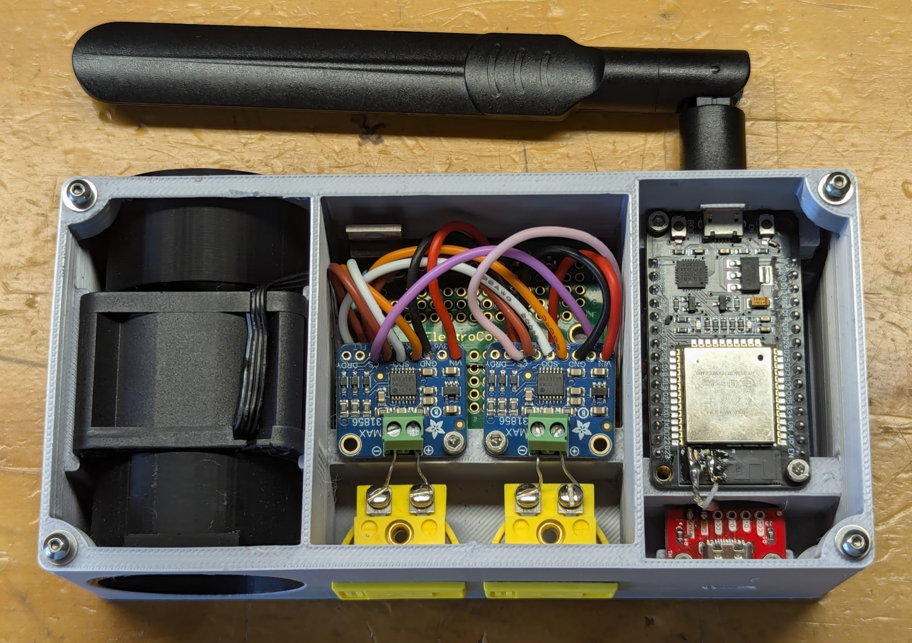
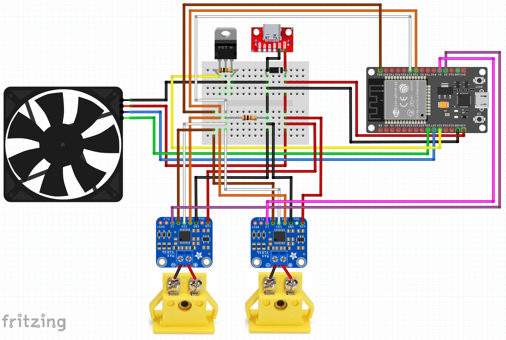

# PitmasterIOT🔥
Blending my passion for technology with the art of BBQing for my loved ones, I embarked on creating the PitmasterIOT. While there are numerous admirable custom and commercial solutions available, I aspired to design something that stands out in its simplicity, affordability, and commitment to being fully open-source.

**Note**: This project is in early preview, and the software is still in development. The UI and PWM fan speed algorithm are works in progress.

## Features
An IoT-enabled device designed specifically for BBQ enthusiasts. This device offers:

- Ambient Temperature Monitoring: Ensures the surroundings are optimal for your BBQ session.
- Food Temperature Tracking: Provides accurate readings of your BBQ's internal temperature, ensuring perfectly cooked meals every time.
- Network Connectivity: Seamlessly connects to your home network, enabling real-time temperature monitoring.
- Interactive Website Interface: All connected devices can access a dynamic website showcasing detailed temperature trends via line charts.
- Integrated Fan System: A compact fan attachment for your BBQ grill, engineered to inject air when necessary. This promotes oxygen circulation, which in turn can intensify the fire and boost heat.
- Smart Heat Management: Employs a sophisticated algorithm that interprets real-time data from the probes, adjusting the fan activity to maintain the desired temperature.
- A WiFi manager to store network details when setup as an Access Point.

With this device, achieve the perfect BBQ every time by combining traditional grilling methods with modern technology.

 

## Hardware
The 3D components of PitmasterIOT were meticulously designed in Tinkercad.com and printed with my Bambu Lab X1-Carbon.

## Software
Our custom Arduino software powers the PitmasterIOT, which is located in the [src](src) folder. Here's an overview of the integrated libraries:
- **WiFi**: Connect to your WiFi network.
- **ESPAsyncWebServer**: Enables multi-client connections.
- **LittleFS**: Manages static file storage.
- **Preferences**: Stores persistent configuration key-value pairs.
- **ArduinoJson**: Handles Websocket payloads.
- **Arduino_JSON**: Manages JSON data structures.
- **MAX31856**: Integrates with the thermocouple.
- **PubSubClient**: Enables MQTT Publishing used for Home Assistant.

## Network Integration
The PitmasterIOT hosts a webpage, leveraging Websockets. This ensures instantaneous message transmission and synchronization across all connected devices, providing users with real-time data for a seamless BBQ experience.

## Home Assistant Integration via MQTT
- Setup includes a Home Assistant Discovery package sent to the configured MQTT. (Home Assistant configuration details coming soon).

## Bidirectional Websocket Events:
- On initial client connection, the server presents HTML/JS/CSS displaying temperature line charts (powered by chart.js).
- Every 5 seconds, the server sends temperature updates to connected clients, refreshing the charts
- Client can publish configuration updates through a dedicated configuration web form

### Discrete Components:
Three discrete components are used, each with a specific purpose: 
1. Flyback Diode:
    - Protects against voltage spikes from inductive loads, specifically to safeguard the PWM fan from sudden interruptions in supply current.
2. 10k Ohm Resistor:
    - Anchors the MOSFET's gate to a known low voltage, averting accidental activation from stray charges or interference, and confirms the MOSFET initializes in the OFF state.
3. MOSFET N-Channel Transistor:
    - Offers exact control over the PWM fan speed and the capability to entirely shut it off, optimizing efficiency and power use.

## Future Directions
We're continually looking to enhance the PitmasterIOT experience. Planned updates include:
- Websocket event storage
- Expanded sensor support (more thermocouple(s) and/or an Oled display)
- Enhanced web user interface

## Acknowledgments
Thanks to the open-source community and all BBQ enthusiasts for their insights and encouragement throughout the development of this project. A special mention to [Random Nerd Tutorials](https://randomnerdtutorials.com)  for their invaluable posts that guided and inspired me.

## Contribution & Licensing
We welcome contributions to the PitmasterIOT project. This project is licensed under the MIT License. See the [LICENSE](LICENSE) file for more details.